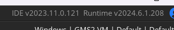

# Moussacre Demo Decomp

This is a decompilation of the Moussacre Demo by Nick Donnoli.

# Setup

Note: I.D.E (Interactive Development Environment) usually should not matter, but newer GameMaker versions will require you to convert the project which I personally do not trust. In the case you are not willing to take any risks, use the closest you can to v2024.6. Use the runtime v2024.6.1.208 aswell, no buts.

- There are no extra steps required (like some sort of piracy check), as this is just a demo.

https://discord.gg/gxmBpKPQhv